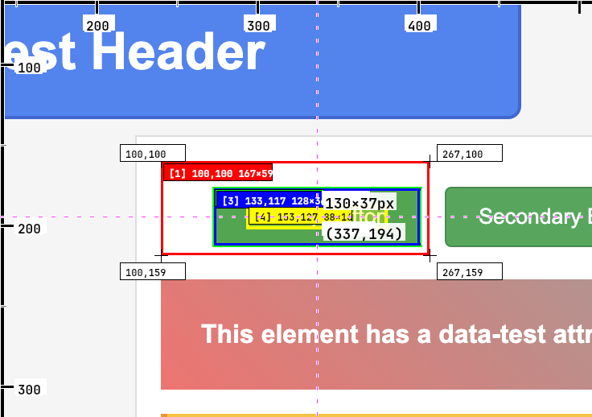

# Inspect-MCP

[](https://www.npmjs.com/package/inspect-mcp)
[](https://opensource.org/licenses/MIT)
[](https://nodejs.org/)

**Visual debugging for pixel-perfect web development.**

Whether you're implementing designs or debugging CSS issues, this tool gives AI agents the ability to see and fix UI problems visually - just like using browser DevTools. Inspect elements, test CSS changes instantly, and iterate until perfect.


---

## The Problem

Getting CSS exactly right is hard. Designs don't match implementation, layouts break across browsers, spacing is off by a few pixels. The usual fix: back-and-forth screenshots, trial and error, and "close enough" compromises.

**The solution:** AI agents that can see your UI, understand what's wrong visually, test fixes instantly, and iterate until pixel-perfect.

---

## How It Works


1. **Inspect** - AI sees current state: styles, layout, visual issues
2. **Test** - Apply CSS edits and see results immediately
3. **Verify** - Get screenshot with changes applied
4. **Iterate** - Refine until perfect
5. **Apply** - Copy working CSS to your code

**The key:** Test changes visually before touching your source code.

---

## What You Get

**Visual debugging** - Screenshots with element highlights and measurements
**Live CSS testing** - Test changes without modifying source files
**Computed styles** - See actual CSS values, not just what's written
**Cascade analysis** - Understand which rules are actually applied
**Multi-element inspection** - Analyze spacing and alignment between elements
**Cross-browser validation** - Test across different viewport sizes

---

## Example: Fixing Button Spacing

**Problem:** "The submit button is too close to the form fields"

```javascript
// Step 1: Inspect current state
{
  "tool": "inspect_element",
  "arguments": {
    "css_selector": ".submit-btn",
    "url": "https://myapp.com/form"
  }
}
// Returns: Screenshot + computed styles showing margin-top: 4px

// Step 2: Test a fix
{
  "tool": "inspect_element",
  "arguments": {
    "css_selector": ".submit-btn",
    "url": "https://myapp.com/form",
    "css_edits": {
      "margin-top": "16px"
    }
  }
}
// Returns: Updated screenshot showing improved spacing

// Step 3: Perfect it
{
  "css_edits": {
    "margin-top": "20px"
  }
}
// Returns: Perfect spacing

// Result: Add margin-top: 20px to your CSS
```




*Before and after: Visual iteration until pixel-perfect*

---

## Quick Start

```bash
# Install and build
npm install inspect-mcp
npm run build
npm start
```

**Connect your AI agent:**
```json
{
  "mcpServers": {
    "inspect-mcp": {
      "command": "node",
      "args": ["/path/to/inspect-mcp/dist/index.js"],
      "transport": "stdio"
    }
  }
}
```

**Try it:**
*"Inspect the header on https://example.com and fix the alignment issues"*

---

## Use Cases

### CSS Debugging
- Fix layout issues visually
- Debug specificity problems
- Test responsive breakpoints
- Validate cross-browser consistency

### Design Implementation
- Match Figma designs pixel-perfectly
- Validate spacing and typography
- Check color accuracy
- Ensure design system compliance

### Quality Assurance
- Visual regression testing
- Component consistency checks
- Accessibility validation
- Performance impact analysis

---

## API Reference

### `inspect_element`

| Parameter | Type | Description |
|-----------|------|-------------|
| `css_selector` | string | CSS selector for target element(s) |
| `url` | string | Webpage URL to inspect |
| `css_edits` | object | **Test CSS changes** before applying to source |
| `property_groups` | array | Focus on: "layout", "colors", "typography", "positioning" |
| `limit` | number | Max elements when selector matches multiple (default: 10) |

### Response Format
```typescript
{
  screenshot: string;          // Base64 PNG with visual highlights
  computed_styles: object;     // Actual CSS property values
  cascade_rules: array;        // CSS rules in cascade order
  box_model: object;          // Margin, padding, border, content dimensions
  applied_edits?: object;     // CSS edits that were tested (if any)
}
```

---

## Technical Details

**Architecture:** MCP (Model Context Protocol) server using Chrome DevTools Protocol for DOM inspection and screenshot capture.

**Requirements:**
- Node.js 18+
- Chrome/Chromium browser
- AI agent with MCP support (Claude Desktop, Continue, etc.)

**Installation:**
```bash
git clone https://github.com/your-repo/inspect-mcp.git
cd inspect-mcp
npm install
npm run build

# Optional: Headless mode
HEADLESS=true npm start
```

---

## Troubleshooting

**Chrome connection issues:**
```bash
chrome --remote-debugging-port=9222
```

**Element not found:**
- Verify CSS selector in browser DevTools
- Check if element loads after page navigation

**Performance:**
- Use specific selectors (avoid broad matches)
- Limit property groups to reduce data
- Set reasonable element limits

---

## Contributing

Found a bug or have ideas?
- [Report issues](https://github.com/your-repo/inspect-mcp/issues)
- [Join discussions](https://github.com/your-repo/inspect-mcp/discussions)

```bash
# Development setup
git clone https://github.com/your-repo/inspect-mcp.git
cd inspect-mcp
npm install
npm test
```

---

## License

MIT License - see [LICENSE](LICENSE) for details.

---

**Made for anyone who believes getting CSS right shouldn't be guesswork**