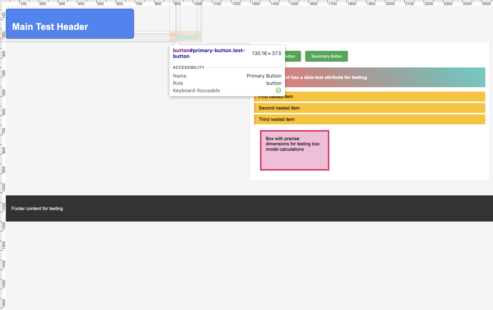
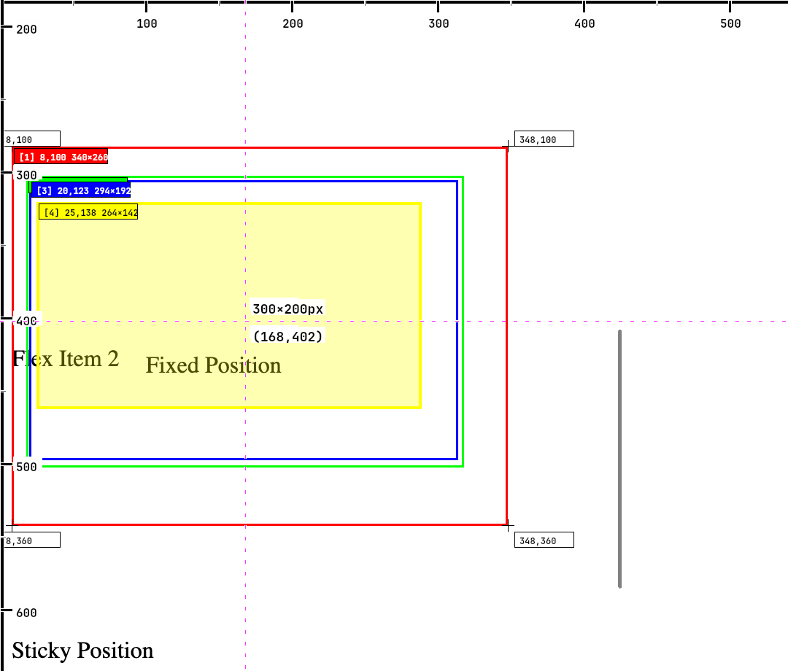
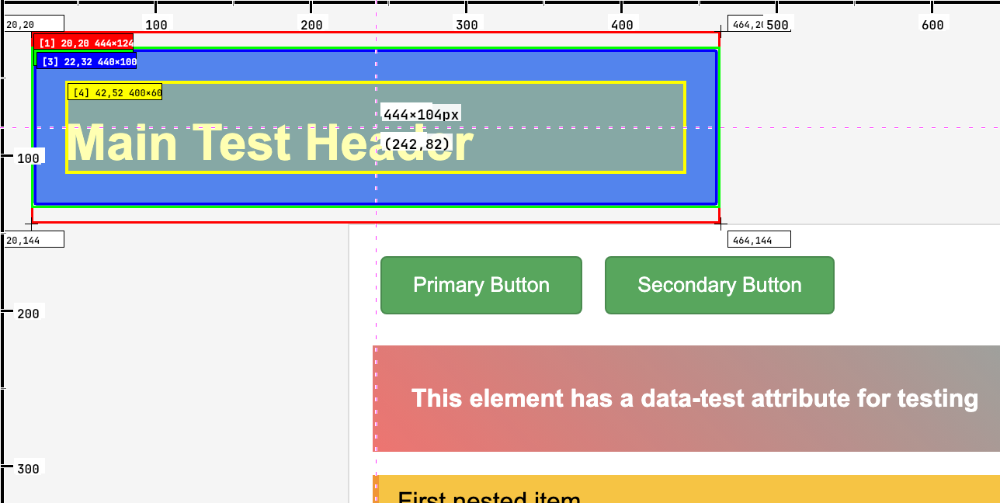
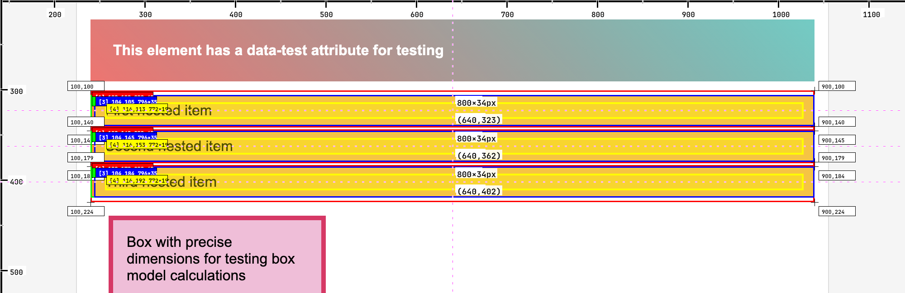
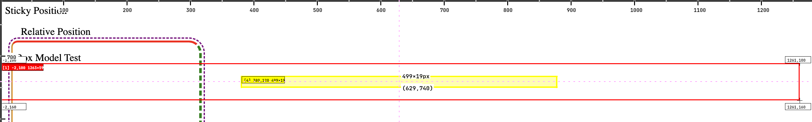

# Inspect-MCP

[](https://www.npmjs.com/package/inspect-mcp)
[](https://opensource.org/licenses/MIT)
[](https://nodejs.org/)

**Bridge the gap between AI coding agents and pixel-perfect web development.**

Inspect-MCP is an MCP (Model Context Protocol) server that enables AI coding agents to inspect, edit, and perfect web UIs through Chrome DevTools Protocol. Instead of guessing layout and styling, agents can programmatically inspect live elements, test CSS modifications, and iterate until pixel-perfect—just like using browser DevTools.


*AI agent inspecting a web element using Inspect-MCP, receiving visual feedback with highlighted overlays and detailed CSS analysis*

## Table of Contents

- [CSS Editing Workflow](#css-editing-workflow)
- [Why Inspect-MCP?](#why-inspect-mcp)
- [Quick Start](#quick-start)
- [Installation](#installation)
- [Configuration](#configuration)
- [API Reference](#api-reference)
- [Examples](#examples)
- [Troubleshooting](#troubleshooting)
- [Contributing](#contributing)
- [License](#license)

## CSS Editing Workflow

Inspect-MCP enables the same iterative workflow you'd use in browser DevTools:



*The iterative CSS editing workflow in action - just like using browser DevTools*


### The Iteration Cycle

1. **🔍 Inspect**: Get current styles, layout, and visual state
2. **✏️ Edit**: Apply test CSS using the `css_edits` parameter  
3. **📸 Verify**: See changes applied in screenshot with exact measurements
4. **🔄 Iterate**: Refine until pixel-perfect
5. **📋 Copy**: Apply working CSS to your source files

### Example: Fixing Button Alignment

```json
// Step 1: Inspect the problematic button
{
  "tool": "inspect_element",
  "arguments": {
    "css_selector": ".submit-btn",
    "url": "https://myapp.com/form"
  }
}

// Step 2: Test a fix
{
  "tool": "inspect_element", 
  "arguments": {
    "css_selector": ".submit-btn",
    "url": "https://myapp.com/form",
    "css_edits": {
      "margin-top": "8px",
      "align-self": "center"
    }
  }
}

// Step 3: Perfect the spacing
{
  "tool": "inspect_element",
  "arguments": {
    "css_selector": ".submit-btn", 
    "url": "https://myapp.com/form",
    "css_edits": {
      "margin-top": "12px",
      "align-self": "center"
    }
  }
}

// ✅ Perfect! Copy margin-top: 12px; align-self: center; to your CSS file
```

## Why Inspect-MCP?

AI coding agents excel at generating code but struggle with visual context when building or debugging web UIs. Common challenges include:

- **Layout mysteries**: "Why is this element misaligned?" 
- **Spacing inconsistencies**: "What's the actual margin here?"
- **Color variations**: "Which shade of blue is this?"
- **Responsive breakpoints**: "How do elements behave across screen sizes?"

### What Inspect-MCP Enables

✅ **Visual debugging**: See actual computed styles, not just CSS rules  
✅ **Live CSS editing**: Test style changes instantly with `css_edits` parameter  
✅ **Layout analysis**: Box model, margins, padding with pixel precision  
✅ **Multi-element relationships**: Spatial calculations between elements  
✅ **Iterative workflow**: Inspect → Edit → Verify → Copy cycle like DevTools  
✅ **Zero-config setup**: Auto-discovers or launches Chrome seamlessly  

### Use Cases for AI Agents

- **UI Bug Fixing**: Inspect → test fixes with `css_edits` → apply working solution
- **Design Implementation**: Match designs pixel-perfectly by iterating until exact  
- **CSS Debugging**: Test different style approaches before touching source code
- **Layout Experimentation**: Try flex, grid, or positioning variations instantly
- **Responsive Testing**: Test CSS changes across different viewport scenarios
- **Component Development**: Perfect spacing, alignment, and colors through iteration

## Quick Start

```bash
# Install and build
npm install
npm run build

# Start the MCP server
npm start
```

Add to your AI agent's MCP configuration:
```json
{
  "mcpServers": {
    "inspect-mcp": {
      "command": "node",
      "args": ["/absolute/path/to/inspect-mcp/dist/index.js"],
      "transport": "stdio"
    }
  }
}
```

Now your AI agent can inspect any web element:
```json
{
  "tool": "inspect_element",
  "arguments": {
    "css_selector": ".header-nav",
    "url": "https://example.com"
  }
}
```

## Installation

### Prerequisites
- **Node.js 18+**
- **Chrome/Chromium browser**
- **AI agent with MCP support** (Claude Desktop, Continue, etc.)

### Setup

1. **Clone and build**:
   ```bash
   git clone https://github.com/your-repo/inspect-mcp.git
   cd inspect-mcp
   npm install
   npm run build
   ```

2. **Configure your AI agent**:
   
   **For Claude Desktop** (`~/Library/Application Support/Claude/claude_desktop_config.json`):
   ```json
   {
     "mcpServers": {
       "inspect-mcp": {
         "command": "node",
         "args": ["/absolute/path/to/inspect-mcp/dist/index.js"],
         "transport": "stdio"
       }
     }
   }
   ```

3. **Optional: Chrome setup**:
   ```bash
   # For better performance, run Chrome with debugging enabled
   chrome --remote-debugging-port=9222
   ```
   
   **Note**: If no debugging-enabled Chrome is found, Inspect-MCP automatically launches one.

## Configuration

### Environment Variables

- **`HEADLESS`**: Control Chrome visibility
  ```bash
  # Visible Chrome (default - useful for debugging)
  npm start
  
  # Headless Chrome (no UI)
  HEADLESS=true npm start
  ```

### Config File

Create `.env` from `.env.example` for persistent settings:
```bash
cp .env.example .env
# Edit .env with your preferences
```

## API Reference

### `inspect_element`

Inspects DOM elements with visual overlays and detailed analysis.

#### Parameters

| Parameter | Type | Required | Description |
|-----------|------|----------|-------------|
| `css_selector` | string | ✅ | CSS selector to find element(s) |
| `url` | string | ✅ | URL to navigate and inspect |
| `property_groups` | string[] | ❌ | CSS property categories: `layout`, `box`, `typography`, `colors`, `effects` |
| `css_edits` | object | ❌ | **Test CSS changes**: Apply inline styles before taking screenshot. Perfect for iterating on fixes! Example: `{"margin": "10px", "color": "red"}` |
| `limit` | number | ❌ | Max elements when multiple match (default: 10, max: 20) |

#### Response Formats

**Single Element**:
```typescript
{
  screenshot: string;        // Base64 PNG with element highlighted
  computed_styles: object;   // Final CSS properties (includes applied edits)
  cascade_rules: array;      // CSS rules in cascade order
  box_model: {              // Layout rectangles
    content: { x, y, width, height };
    padding: { x, y, width, height };
    border: { x, y, width, height };
    margin: { x, y, width, height };
  };
  applied_edits?: object;    // CSS edits that were applied (if any)
}
```

**Multiple Elements**:
```typescript
{
  screenshot: string;        // Base64 PNG with color-coded highlights
  elements: [{              // Individual element inspections (each includes applied_edits if any)
    computed_styles: object;
    cascade_rules: array;
    box_model: object;
    applied_edits?: object;
  }];
  relationships: [{         // Spatial analysis between elements
    from: string;
    to: string;
    distance: {
      horizontal: number;
      vertical: number;
      center_to_center: number;
    };
    alignment: {
      top: boolean;
      left: boolean;
      vertical_center: boolean;
      horizontal_center: boolean;
    };
  }]
}
```



*Box model visualization with precise measurements for each layer*

## Examples

### Basic Element Inspection

```json
{
  "tool": "inspect_element",
  "arguments": {
    "css_selector": ".main-header",
    "url": "https://github.com"
  }
}
```



*Single element inspection showing GitHub's header with detailed analysis*

### Multi-Element Layout Analysis

```json
{
  "tool": "inspect_element", 
  "arguments": {
    "css_selector": ".nav-item",
    "url": "https://github.com",
    "property_groups": ["layout", "colors"],
    "limit": 5
  }
}
```



*Multi-element layout analysis with color-coded highlights and spatial relationships*



*Property groups filtering - showing only layout and colors properties instead of all CSS properties*

### Iterative CSS Debugging 

**Scenario**: Button is too close to the edge and needs better spacing

```json
// Step 1: Inspect current state
{
  "tool": "inspect_element",
  "arguments": {
    "css_selector": ".action-button",
    "url": "https://localhost:3000"
  }
}
// Shows: margin-left: 0px, button touching container edge

// Step 2: Test initial fix  
{
  "tool": "inspect_element",
  "arguments": {
    "css_selector": ".action-button", 
    "url": "https://localhost:3000",
    "css_edits": {
      "margin-left": "20px"
    }
  }
}
// Shows: Better, but still feels cramped

// Step 3: Perfect the spacing
{
  "tool": "inspect_element",
  "arguments": {
    "css_selector": ".action-button",
    "url": "https://localhost:3000", 
    "css_edits": {
      "margin-left": "32px",
      "margin-top": "16px"
    }
  }
}
// Shows: Perfect alignment with design system grid!

// ✅ Apply to source: .action-button { margin-left: 32px; margin-top: 16px; }
```


*Before and after comparison showing the iterative CSS editing process - from cramped spacing to perfect alignment*

### Common AI Agent Workflows

1. **"Fix this misaligned button"**
   - Inspect button to see current positioning
   - Test alignment fixes with `css_edits`: `{"align-self": "center"}`
   - Iterate on spacing until perfectly aligned
   - Copy working CSS to source file

2. **"Match this design exactly"**
   - Inspect target elements for current measurements  
   - Test design values with `css_edits`: `{"padding": "24px", "gap": "16px"}`
   - Compare against design specs using spatial relationships
   - Iterate until pixel-perfect match

3. **"Why isn't my CSS working?"**
   - Inspect to see computed vs expected styles
   - Test override with `css_edits`: `{"color": "red !important"}`
   - Analyze cascade rules to understand specificity
   - Apply working solution to source with proper specificity

## Troubleshooting

### Common Issues

**Chrome Connection Failed**
```
Error: No Chrome instances found
```
**Solution**: Ensure Chrome is installed or run:
```bash
chrome --remote-debugging-port=9222
```

**Element Not Found**
```
Error: No elements found matching selector
```
**Solution**: 
- Verify CSS selector accuracy
- Check if element loads after page navigation
- Try more specific or general selectors

**Screenshot Too Large**
```
Error: Screenshot exceeds size limits
```
**Solution**: Use `limit` parameter to reduce elements inspected

**Permission Denied**
```
Error: Cannot access URL
```
**Solution**: 
- Check URL accessibility
- Verify network connectivity
- For local development, ensure dev server is running

### Debug Mode

Run with visible Chrome for debugging:
```bash
HEADLESS=false npm start
```

### Performance Tips

- **Reuse Chrome instances**: Keep debugging Chrome open
- **Limit property groups**: Only request needed CSS categories  
- **Use specific selectors**: Avoid broad selectors that match many elements
- **Set reasonable limits**: Default 10 elements max for performance

## Contributing

We welcome contributions! Here's how to get started:

### Development Setup

```bash
git clone https://github.com/your-repo/inspect-mcp.git
cd inspect-mcp
npm install
npm run build
```

### Running Tests

```bash
npm test
```

### Code Style

- TypeScript with strict typing
- ESLint for code quality
- Prettier for formatting
- Comprehensive error handling

### Submitting Changes

1. Fork the repository
2. Create feature branch: `git checkout -b feature-name`
3. Make changes with tests
4. Run `npm test` to verify
5. Submit pull request with clear description

### Reporting Issues

Found a bug or have a feature request?
- Check existing issues first
- Include browser version, Node.js version, and reproduction steps
- For performance issues, include timing information

## Project Status

**Current**: v0.1.0 - Stable core functionality  
**Next**: Enhanced property filtering, performance optimizations

### Roadmap

- [ ] Element highlighting customization
- [ ] Batch inspection for multiple selectors
- [ ] Performance profiling integration
- [ ] CSS modification workflow improvements

## Support

- **Documentation**: [GitHub Wiki](https://github.com/your-repo/inspect-mcp/wiki)
- **Issues**: [Bug Reports & Feature Requests](https://github.com/your-repo/inspect-mcp/issues)
- **Discussions**: [Community Forum](https://github.com/your-repo/inspect-mcp/discussions)

## License

MIT License - see [LICENSE](LICENSE) file for details.

---

**Made for AI agents building pixel-perfect web experiences** 🤖✨